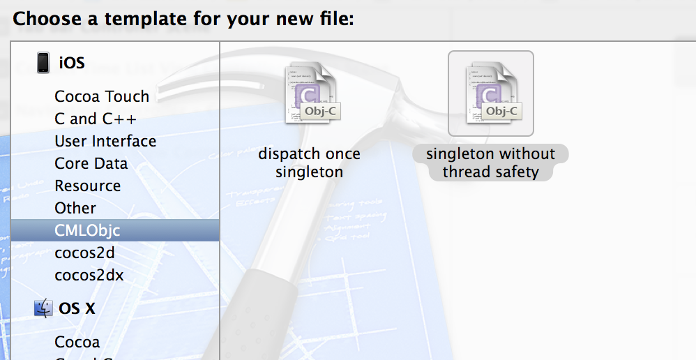

ObjcSingletonTemplate
=====================

Xcode Objective-C singleton template

use "python install.py" to install templates automaticlly, it will delete this directory: ～/Library/Developer/Xcode/Templates/File Templates/CMLObjc, so back up if you need it.

or you can do this by yourself:
copy the CMLObjc folder to ～/Library/Developer/Xcode/Templates/File Templates

